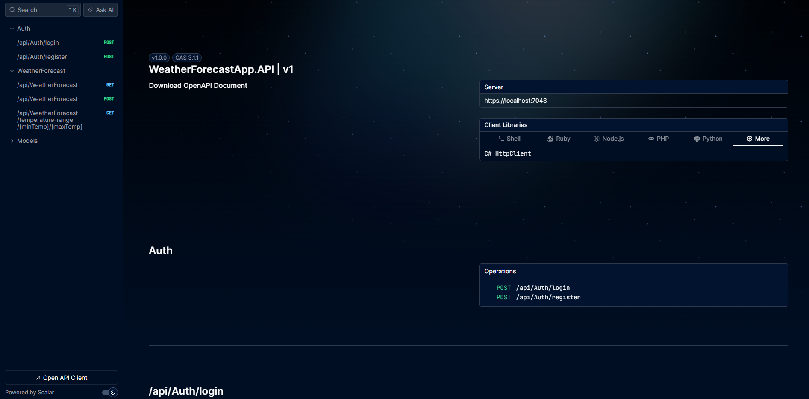
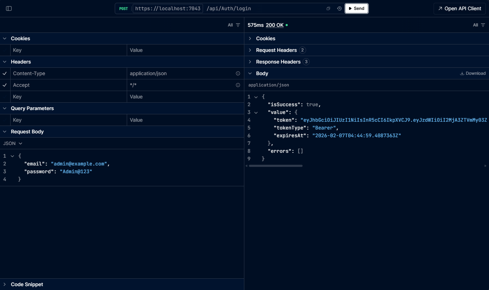
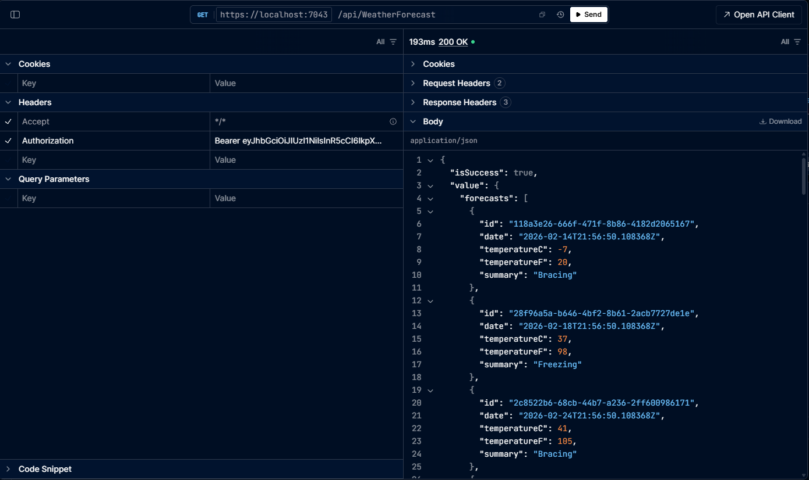
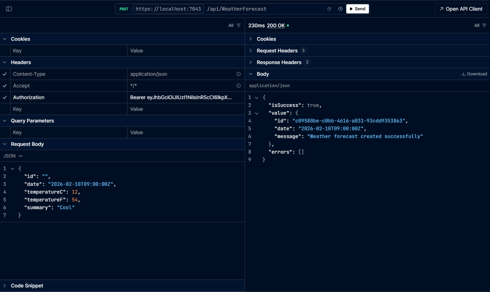
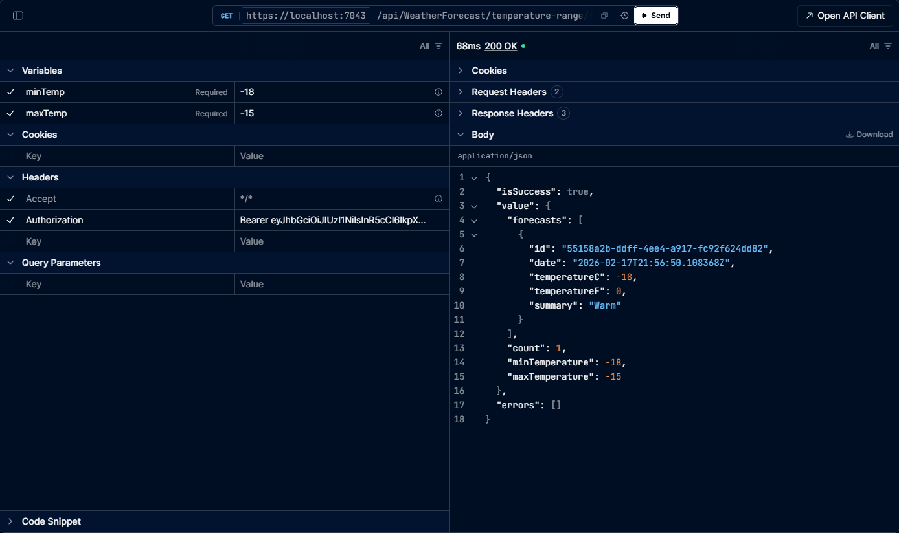

# Weather Forecast API

A .NET 10 ASP.NET Core Web API for weather forecasts with JWT authentication, built using **Clean Architecture**, **CQRS** (MediatR), and **Unit of Work** pattern.

For a full **A-to-Z** account of what was built, why, and how (with examples), see **[PROJECT_DETAILS.md](PROJECT_DETAILS.md)**.

---

## Table of Contents

- [Screenshots](#screenshots)
- [Features](#features)
- [Tech Stack](#tech-stack)
- [Solution Structure](#solution-structure)
- [Architecture](#architecture)
- [Prerequisites](#prerequisites)
- [Getting Started](#getting-started)
- [Configuration](#configuration)
- [Rate limiting](#rate-limiting)
- [API Endpoints](#api-endpoints)
- [Authentication](#authentication)
- [Database](#database)
- [EF Core commands](#ef-core-commands)
- [Testing](#testing)
- [Project Conventions](#project-conventions)

---

## Screenshots

**API overview (Scalar)**



**Login**



**Get all forecasts**



**Create forecast**



**Get by temperature range**



---

## Features

- **Weather forecast** CRUD and queries (get all, get by temperature range)
- **JWT-based authentication** (register, login)
- **Rate limiting** (fixed window, sliding window, token bucket)
- **Global exception handling** and structured error responses
- **Request validation** via FluentValidation
- **Structured logging** with Serilog (console + file)
- **OpenAPI** with Scalar UI (development)
- **PostgreSQL** with Entity Framework Core and migrations
- **Unit tests** for application and infrastructure services

---

## Tech Stack

| Layer / Concern | Technology |
|-----------------|------------|
| Runtime | .NET 10 |
| API | ASP.NET Core Web API |
| Auth | JWT Bearer, BCrypt |
| Database | PostgreSQL, Entity Framework Core 10 |
| CQRS / MediatR | MediatR, FluentValidation |
| Mapping | Mapster |
| Logging | Serilog |
| API docs | OpenAPI, Scalar |
| Testing | xUnit, Moq |

---

## Solution Structure

```
WeatherForecastApp/
├── src/
│   ├── WeatherForecastApp.API/           # Web API (controllers, middleware, DI)
│   ├── WeatherForecastApp.Application/    # Use cases, DTOs, contracts, services
│   ├── WeatherForecastApp.Domain/         # Entities, value objects, domain logic
│   └── WeatherForecastApp.Infrastructure/ # EF Core, repositories, JWT, BCrypt
├── tests/
│   └── WeatherForecastApp.UnitTests/      # Unit tests for services
├── WeatherForecastApp.slnx
└── README.md
```

- **API** – HTTP pipeline, JWT setup, rate limiting, controllers. References Application + Infrastructure.
- **Application** – Commands/queries, handlers, validators, DTOs, repository/service contracts. References Domain only.
- **Domain** – Entities (`User`, `WeatherForecast`), value objects (`Temperature`), base entity, domain exceptions. No external references.
- **Infrastructure** – DbContext, repositories, Unit of Work, JWT token generation, password hashing, seed data. Implements Application contracts and references Domain.

---

## Architecture

- **Clean Architecture**: dependencies point inward (API → Application/Infrastructure → Domain).
- **CQRS**: commands and queries via MediatR; handlers use application services and repositories.
- **Unit of Work**: all persistence (create/update/delete) goes through `IUnitOfWork`; repositories only register changes until `SaveAsync()` is called.
- **Global usings**: used across projects to keep files clean and consistent.

---

## Prerequisites

- [.NET 10 SDK](https://dotnet.microsoft.com/download)
- [PostgreSQL](https://www.postgresql.org/) (e.g. local server or Docker)
- IDE: Visual Studio 2022+ or VS Code with C# extension

---

## Getting Started

### 1. Clone and restore

```bash
git clone <repository-url>
cd WeatherForecastApp
dotnet restore
dotnet tool restore
```

The project uses a [local .NET tools manifest](.config/dotnet-tools.json) so that the EF Core CLI (`dotnet ef`) is available after `dotnet tool restore`. Alternatively, install globally: `dotnet tool install --global dotnet-ef`.

### 2. Configure database

Set the connection string in `src/WeatherForecastApp.API/appsettings.Development.json` (or via environment/user secrets):

```json
"ConnectionStrings": {
  "DefaultConnection": "Host=localhost;Port=5432;Database=WeatherForecastDb;Username=postgres;Password=YOUR_PASSWORD"
}
```

### 3. Apply migrations

From the repository root (see [EF Core commands](#ef-core-commands) for more):

```bash
dotnet ef database update --project src/WeatherForecastApp.Infrastructure --startup-project src/WeatherForecastApp.API
```

### 4. Run the API

```bash
dotnet run --project src/WeatherForecastApp.API
```

The API runs (by default) at the URLs in `launchSettings.json` (e.g. `https://localhost:7xxx`).  
On first run, seed data creates sample weather forecasts and a default user (see [Database](#database)).

### 5. Run tests

```bash
dotnet test tests/WeatherForecastApp.UnitTests/WeatherForecastApp.UnitTests.csproj
```

---

## Configuration

### JWT (`appsettings.json` / `appsettings.Development.json`)

```json
"Jwt": {
  "Secret": "AtLeast32CharactersLongSecretKey!",
  "Issuer": "WeatherForecastApp",
  "Audience": "WeatherForecastApp",
  "ExpirationMinutes": 1440
}
```

- **Secret** must be at least 32 characters. In production use environment variables or a secrets manager.
- **ExpirationMinutes**: token lifetime (e.g. 1440 = 24 hours).

### Rate limiting

See [Rate limiting](#rate-limiting) for how each policy works and where it is used. Settings live under `RateLimiting` in `appsettings.Development.json`.

### Logging

Serilog is configured in `appsettings.Development.json`: console and file sinks, minimum levels, and enrichers (machine name, thread id, etc.).

---

## Rate limiting

Requests are limited **per partition**: by authenticated user name or, if not logged in, by **client IP**. When a limit is exceeded, the API returns **429 Too Many Requests** and a `retryAfter` value (in seconds). Up to `QueueLimit` requests can wait in a queue; extra requests are rejected immediately.

Three policies are configured; each works differently.

### 1. Fixed window

**What it does:** Allows a fixed number of requests in each **fixed time window**. The window resets at fixed boundaries (e.g. every minute), regardless of when the first request was made.

**Example (default: 100 requests per 1 minute):**

- Window 1: 10:00:00–10:01:00 → you can make 100 requests.
- At 10:00:30 you use 100 requests → you are blocked until 10:01:00.
- At 10:01:00 a **new** window starts → you get 100 requests again.

So you can theoretically do 100 at the end of one window and 100 at the start of the next (burst of 200 in a short time).

**Used in this project:** Applied **globally** to all controllers via `RequireRateLimiting(FixedWindow)` (and as the global limiter). So every endpoint gets this limit per user/IP unless overridden.

**Config:** `PermitLimit`, `WindowMinutes`, `QueueLimit`.

---

### 2. Sliding window

**What it does:** Similar to fixed window, but the window **slides** with time. The limit applies to the last *window duration* from “now”, so bursts are smoothed: you cannot get a full new quota just because the clock ticked to the next minute. The window is split into **segments**; expiry is checked per segment.

**Example (default: 50 requests per 1 minute, 2 segments):**

- At 10:00:00 you make 50 requests → all 50 count in the current sliding window.
- At 10:00:30 (half a minute later) the oldest segment expires; you have ~25 requests left in the window → you can make ~25 more.
- At 10:01:00 the window has fully “slid”; you can make up to 50 again.

So you get a more even cap over any 1‑minute period, not a hard reset every minute.

**Used in this project:** Applied to **weather forecast endpoints** only via `[EnableRateLimiting(SlidingWindow)]` on `WeatherForecastController`. Auth endpoints still use the global (fixed window) limiter.

**Config:** `SlidingWindowPermitLimit`, `SlidingWindowMinutes`, `SegmentsPerWindow`, `QueueLimit`.

---

### 3. Token bucket

**What it does:** You have a **bucket** with a max number of **tokens**. Each request consumes one token. Tokens are **replenished** at a fixed rate (e.g. 10 tokens every 10 seconds) up to the bucket cap. So you get **sustained** rate (replenishment) plus allowed **burst** (bucket size).

**Example (default: bucket size 100, add 10 tokens every 10 seconds):**

- Start: 100 tokens.
- You send 100 requests in 1 second → 0 tokens left; further requests are rejected until tokens are added.
- After 10 seconds: 10 tokens → you can make 10 requests.
- After 20 more seconds: 30 tokens total (capped at 100 if you don’t use them).

Good for allowing short bursts while keeping long‑term rate under control.

**Used in this project:** **Defined** in `ServiceCollectionExtensions` as `TokenBucket` policy but **not applied** to any controller. You can use it by adding `[EnableRateLimiting(RateLimitingPolicies.TokenBucket)]` on a controller or action.

**Config:** `TokenLimit`, `ReplenishmentPeriodSeconds`, `TokensPerPeriod`, `QueueLimit`.

---

### Summary

| Policy        | Idea                     | Best for                         | In this app                          |
|---------------|--------------------------|-----------------------------------|--------------------------------------|
| **Fixed**     | N requests per fixed 1‑min window | Simple per‑minute caps           | Global (all endpoints)                |
| **Sliding**   | N requests in last 1 min (sliding) | Smoother, less bursty limits     | Weather forecast controller only      |
| **Token bucket** | Burst + steady refill          | Burst + sustained rate           | Available; not applied to any route   |

When any limit is hit, the response is **429** with a JSON body containing `error` and `retryAfter` (seconds). The `Retry-After` header is also set when available.

---

## API Endpoints

Base URL: `/api` (e.g. `https://localhost:7xxx/api`).

### Authentication (no token required)

| Method | Endpoint | Description |
|--------|----------|-------------|
| POST | `/api/auth/register` | Register a new user (email, password). |
| POST | `/api/auth/login` | Login; returns JWT and expiry. |

### Weather forecasts (require `Authorization: Bearer <token>`)

| Method | Endpoint | Description |
|--------|----------|-------------|
| GET | `/api/WeatherForecast` | Get all weather forecasts. |
| POST | `/api/WeatherForecast` | Create a weather forecast (body: `WeatherForecastDto`). |
| GET | `/api/WeatherForecast/temperature-range/{minTemp}/{maxTemp}` | Get forecasts within a temperature range. |

### Example: register and login

**Register**

```http
POST /api/auth/register
Content-Type: application/json

{
  "email": "user@example.com",
  "password": "YourPassword123"
}
```

**Login**

```http
POST /api/auth/login
Content-Type: application/json

{
  "email": "user@example.com",
  "password": "YourPassword123"
}
```

Response includes `token`, `tokenType` (e.g. `"Bearer"`), and `expiresAt`. Use the token in the header for protected endpoints:

```http
Authorization: Bearer <your-jwt-token>
```

### Example: create forecast (authenticated)

```http
POST /api/WeatherForecast
Content-Type: application/json
Authorization: Bearer <token>

{
  "date": "2026-02-10T00:00:00Z",
  "temperatureC": 22,
  "temperatureF": 72,
  "summary": "Mild"
}
```

---

## Authentication

- **Registration**: email + password; password is hashed with BCrypt and stored. Duplicate email returns an error.
- **Login**: returns a JWT containing user id and email. Token is validated on every request to protected endpoints.
- **Protected routes**: `WeatherForecastController` is annotated with `[Authorize]`; all its actions require a valid JWT.
- **Persistence**: Auth uses the same Unit of Work and repository pattern; no direct `SaveChanges` outside `IUnitOfWork`.

---

## Database

- **Provider**: PostgreSQL.
- **DbContext**: `WeatherForecastApp.Infrastructure.Persistence.WeatherForecastDbContext`.
- **Tables**: `WeatherForecasts`, `Users` (migrations in `Infrastructure/Persistence/Migrations`).
- **Seed data**: On startup, `ISeedDataService` runs and:
  - Creates an admin user if none exists: **Email** `admin@example.com`, **Password** `Admin@123`.
  - Seeds 30 sample weather forecasts if the table is empty.
- **Unit of Work**: All writes (including seed) go through repositories and `IUnitOfWork.SaveAsync()`.

---

## EF Core commands

The EF Core CLI is provided via a **local tool** (see `.config/dotnet-tools.json`). From the repository root, run commands with:

- **`--project`**: `src/WeatherForecastApp.Infrastructure` (contains the DbContext and migrations)
- **`--startup-project`**: `src/WeatherForecastApp.API` (loads connection string and configuration)

### Install the tool (first time)

```bash
dotnet tool restore
```

Or install globally: `dotnet tool install --global dotnet-ef`.

### Apply migrations (update database)

```bash
dotnet ef database update --project src/WeatherForecastApp.Infrastructure --startup-project src/WeatherForecastApp.API
```

### Add a new migration

```bash
dotnet ef migrations add MigrationName --project src/WeatherForecastApp.Infrastructure --startup-project src/WeatherForecastApp.API
```

### Remove the last migration (if not applied)

```bash
dotnet ef migrations remove --project src/WeatherForecastApp.Infrastructure --startup-project src/WeatherForecastApp.API
```

### Generate SQL script (without applying)

```bash
dotnet ef migrations script --project src/WeatherForecastApp.Infrastructure --startup-project src/WeatherForecastApp.API --output migration.sql
```

### Drop the database (connection string from startup project)

```bash
dotnet ef database drop --project src/WeatherForecastApp.Infrastructure --startup-project src/WeatherForecastApp.API
```

---

## Testing

- **Location**: `tests/WeatherForecastApp.UnitTests`.
- **Framework**: xUnit, Moq.
- **Scope**: Unit tests for application and infrastructure services.

### Test projects and namespaces

- **WeatherForecastApp.UnitTests**
  - `Services/AuthServiceTests.cs` – Login/register success and failure cases.
  - `Services/WeatherForecastServiceTests.cs` – Create, get all, get by range (mocked repo and UoW).
  - `Services/JwtTokenServiceTests.cs` – Token generation and shape.
  - `Services/BCryptPasswordHasherTests.cs` – Hash and verify.
  - `Services/SeedDataServiceTests.cs` – Seed behaviour when user/forecasts exist or not.
  - `TestHelpers/DomainTestHelper.cs` – Helper for setting entity IDs in tests (e.g. reflection).

Run all tests:

```bash
dotnet test tests/WeatherForecastApp.UnitTests/WeatherForecastApp.UnitTests.csproj
```

Run with coverage (if coverlet is configured):

```bash
dotnet test tests/WeatherForecastApp.UnitTests --collect:"XPlat Code Coverage"
```

---

## Project Conventions

- **Global usings**: Each project has a `GlobalUsings.cs` for shared namespaces; minimal per-file `using` statements.
- **DTOs**: Grouped by feature under `Application/DTOs` (e.g. `DTOs/Auth`, `DTOs/WeatherForecasts`).
- **Features**: CQRS under `Application/Features` (e.g. `Auth/Commands`, `WeatherForecasts/Queries`), with validators and handlers.
- **Contracts**: Repository and service interfaces in `Application/Contracts`; implementations in `Infrastructure`.
- **Result type**: Application layer uses `Result<T>` / `Result` for success/failure and error messages; API returns appropriate HTTP status and body from these results.

---

## License

Not specified. Use according to your project policy.
